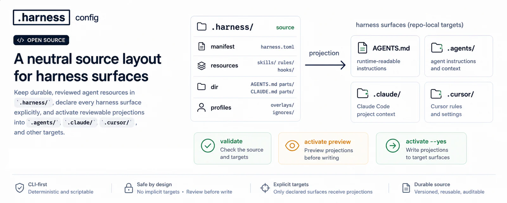

# Harness config

<p align="center">
  
</p>

[](https://www.harnessconfig.dev/)
[](https://www.harnessconfig.dev/specifications/v1/)
[](https://github.com/reachjalil/harness-config/actions/workflows/ci.yml?query=branch%3Amain)
[](https://www.npmjs.com/package/harnessc)
[](https://www.npmjs.com/package/@harnessconfig/core)
[](./SECURITY.md)
[](./LICENSE)

Harness config is an open-source specification proposal and alpha TypeScript
reference implementation for repository-local AI agent configuration. It keeps
durable prompts, skills, rules, hooks, and instruction parts in reviewed source
roots, then projects them into the live harness surfaces each tool reads.

```text
.harness/ source  ->  validate  ->  preview activation  ->  live surfaces

AGENTS.md   .agents/   .claude/   .cursor/   custom targets
```

## Status

Harness config has two independent version lines:

| Line | Current status | Meaning |
| --- | --- | --- |
| Specification | `v1` proposal | File shape, manifest schema, projection model, ignore grammar, and conformance contract. |
| Reference implementation | `1.0.0-alpha.10` | The npm packages and CLI implementation. Package releases do not imply a spec change. |

Treat the v1 file shape and activation model as a public proposal while public
releases, conformance fixtures, adopter repositories, and external feedback
mature. Once v1 is accepted, incompatible repository or implementation changes
are reserved for v2.

## The Problem

Modern repositories often carry several AI-tool surfaces side by side:

```text
AGENTS.md
CLAUDE.md
.agents/
.claude/
.cursor/
.github/copilot-instructions.md
.github/instructions/*.instructions.md
```

Each surface is useful. The problem starts when the same prompt, skill, rule,
or hook is copied into multiple places and only one copy changes. Some tools
also write settings, permissions, allow-lists, learned commands, or local state
back into the same folders they read.

That leaves teams with a practical question:

> Which file is the reviewed source of truth, and which files are just live
> runtime surfaces?

Harness config makes that ownership boundary explicit.

## What It Does

Harness config separates three things that are often mixed together:

- **Repo-owned source**: durable configuration reviewed in Git, commonly under
  `./.harness`.
- **Generated harness surfaces**: files and folders such as `AGENTS.md`,
  `.agents/`, `.claude/`, `.cursor/`, or another declared output.
- **Runtime-owned mutable files**: target files seeded from source once, then
  left to the harness runtime unless the user explicitly forces re-projection.

The result is a one-way projection model:

```text
reviewed source roots
  -> manifest + profiles + overrides + ignore/mutable rules
  -> dry-run activation plan
  -> explicit live harness surfaces
```

The standard is implementation-neutral. `harnessc` is the alpha reference CLI;
the contract is the repository shape and activation behavior.

## Quick Start

Requires Node.js `>=22.12.0`.

Run the CLI through npm:

```bash
npx harnessc
npx harnessc init
npx harnessc validate
npx harnessc explain .agents/skills/review/SKILL.md
npx harnessc activate
npx harnessc activate --yes
```

The important CLI rule is simple:

```text
no --yes  -> preview only
--yes     -> write changes
```

Use the website and specification as the reference when asking an AI agent to
adopt the standard:

```text
Update this repository to use Harness config. Use https://www.harnessconfig.dev/
as the reference, keep reusable agent instructions under .harness, and project
explicit targets with harnessc.
```

## Minimal Layout

```text
.harness/
  harness.toml
  resources/
    skills/
      review/
        SKILL.md
        .claude/
          SKILL.md
  dir/
    AGENTS.md/
      .harnessComposable
      100_intro.md
      200_rules.md
.harnessIgnore
.harnessMutable
```

```toml
version = 1

[[resources]]
path = "./.harness/resources"

[[targets]]
path = "./.agents"

[[targets]]
path = "./.claude"

[[dir]]
path = "./.harness/dir"
```

In that shape:

- `[[resources]]` projects reusable resources into every declared target.
- `[[targets]]` declares static live target folders that may receive
  projection; an optional `parent` can place those outputs under an external
  folder such as a sibling worktree.
- `[[dir]]` produces repo-relative outputs such as `AGENTS.md`.
- `[[resources]].path`, `[[dir]].path`, and `[[targets]].parent` may use
  gitignore-style wildcard patterns. `[[targets]].path` is always explicit
  because activation may need to create it.
- `.claude/` inside a resource is a target-derived override for the `.claude`
  target.
- `.harnessComposable` assembles one output file from ordered parts.

## Core Principles

- **Explicit targets only.** A folder receives projection only when declared in
  the selected manifest. There are no implicit target folders, and target paths
  stay static even when a parent pattern expands to multiple output parents.
- **Ordered source roots.** `[[resources]]` and `[[dir]]` entries define the
  source roots that participate in projection; wildcard entries expand only to
  existing real directories.
- **Copy projection.** Targets are materialized as ordinary files, not
  symlinks.
- **Dry-run first.** `harnessc init`, `harnessc activate`, and extension
  activation preview by default and write only with `--yes`.
- **Live surfaces are outputs.** `.agents/`, `.claude/`, `.cursor/`, and
  similar folders are harness surfaces, not source repositories.
- **Mutable is not ignore.** `.harnessIgnore` excludes files from projection.
  `.harnessMutable` seeds files once and then treats target bytes as
  runtime-owned.
- **Profiles and dir composition are local file contracts.** Profiles add
  source overlays; `[[dir]]` composes or copies repo-relative outputs.
- **Cleanup is conservative.** Unmanaged and orphaned outputs are preserved by
  default unless cleanup is explicit.
- **Local-first tooling.** Validation, planning, and activation operate on
  repository files locally.

## Safety And Privacy

Harness config is conservative because activation mutates live files:

- planned creates, updates, removals, keeps, orphaned managed outputs,
  preserved unmanaged entries, and mutable skips are visible before writes;
- unmanaged files are kept by default;
- target-output `.harnessIgnore` and `.harnessProfile` files are preserved as
  local controls;
- symlinks are treated as leaf entries and are not followed;
- target symlink replacement requires an explicit policy or flag.

Harness config does not collect telemetry. The `harnessc` CLI does not send
analytics, usage events, file paths, repository names, command history, machine
identifiers, or error reports. The CLI does not make network requests during
normal validation, planning, or activation.

## What It Is Not

Harness config is not a hosted service, package manager, marketplace,
permission system, memory layer, synchronization service, or agent SDK. It does
not define how a harness runtime behaves after reading its files.

Those concerns belong in tools and products that build on top of the standard.
Harness config keeps v1 focused on the repo-local source-to-surface contract.

## Packages

| Package | Purpose |
| --- | --- |
| [`harnessc`](https://www.npmjs.com/package/harnessc) | Public `npx harnessc` command. |
| [`@harnessconfig/cli`](./packages/cli/README.md) | Scoped CLI implementation package. |
| [`@harnessconfig/core`](./packages/core/README.md) | TypeScript schemas, validation, planning, projection, ignore parsing, and dir composition helpers. |

## Examples

The [`examples/`](./examples/README.md) directory contains runnable scenarios:

- [01 multi runtime, one source](./examples/01-multi-runtime-one-source/README.md)
- [02 profile mode switching](./examples/02-profile-mode-switching/README.md)
- [03 team kits](./examples/03-team-kits/README.md)
- [04 composable instructions](./examples/04-composable-instructions/README.md)
- [05 runtime-owned state](./examples/05-runtime-owned-state/README.md)
- [06 layered local overlays](./examples/06-layered-local-overlays/README.md)
- [07 worktree fleet wildcards](./examples/07-worktree-fleet-wildcards/README.md)
- [08 monorepo package wildcards](./examples/08-monorepo-package-wildcards/README.md)
- [09 isolated profile packs](./examples/09-isolated-profile-packs/README.md)

Profile-switching examples use `--remove-orphans` when applying a new profile
so unedited outputs from the previous profile are cleaned up. Use
`--remove-unmanaged` for target files that no configured source can produce
anymore, such as outputs from deleted or newly ignored source files.

## Documentation

| Document | Use it for |
| --- | --- |
| [Rationale](./docs/RATIONALE.md) | Why the source-to-surface model exists. |
| [Standard](./docs/STANDARD.md) | Normative v1 repository contract. |
| [Tooling](./docs/TOOLING.md) | CLI behavior, flags, dry-run semantics, and output ownership. |
| [Conformance](./docs/CONFORMANCE.md) | Repository, tool, projection, dir, profile, ignore, and mutable-file claims. |
| [Adoption](./docs/ADOPTION.md) | Migration and setup guidance. |
| [Diagnostics](./docs/DIAGNOSTICS.md) | Diagnostic codes and expected meanings. |
| [Testing](./docs/TESTING.md) | Scenario map and fixture coverage. |
| [Governance](./docs/GOVERNANCE.md) | Versioning, proposal process, and spec evolution. |
| [Release notes](./docs/RELEASE_NOTES.md) | Package release history. |

Website: https://www.harnessconfig.dev/

Specification: https://www.harnessconfig.dev/specifications/v1/

## Development

Install and build:

```bash
pnpm install
pnpm build
```

Focused checks:

```bash
pnpm --filter @harnessconfig/core test
pnpm --filter @harnessconfig/cli test
pnpm run harness:check
pnpm run check
pnpm run lint
```

Full release-quality gate:

```bash
pnpm run quality
```

Use the built CLI directly when testing fixtures:

```bash
node packages/cli/dist/bin.js validate --root <fixture>
node packages/cli/dist/bin.js activate --root <fixture>
node packages/cli/dist/bin.js activate --root <fixture> --yes
```

Regenerate this repository's own projected harness outputs:

```bash
pnpm run harness:activate
```

## Contributing

Issues, compatibility notes, examples, and pull requests are welcome. Start
with:

- [CONTRIBUTING.md](./CONTRIBUTING.md)
- [SECURITY.md](./SECURITY.md)
- [docs/DEVELOPMENT.md](./docs/DEVELOPMENT.md)
- [RELEASE-CHECKLIST.md](./RELEASE-CHECKLIST.md)

## License

Harness config is released under the [Apache License 2.0](./LICENSE).
